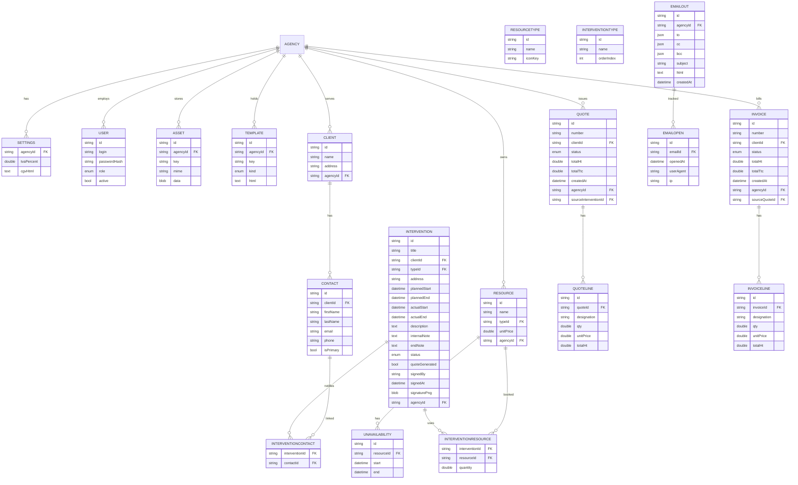

# ERD (Mermaid) — Gestion Matériel
_MàJ: 2025-09-24T14:29:12Z_

```mermaid
erDiagram
  AGENCY ||--o{ SETTINGS : has
  AGENCY ||--o{ USER : employs
  AGENCY ||--o{ ASSET : stores
  AGENCY ||--o{ TEMPLATE : holds
  AGENCY ||--o{ CLIENT : serves
  AGENCY ||--o{ RESOURCE : owns
  AGENCY ||--o{ QUOTE : issues
  AGENCY ||--o{ INVOICE : bills

  USER {
    string id
    string login
    string passwordHash
    enum role
    bool active
  }
  SETTINGS {
    string agencyId FK
    double tvaPercent
    text cgvHtml
  }
  ASSET {
    string id
    string agencyId FK
    string key
    string mime
    blob data
  }
  TEMPLATE {
    string id
    string agencyId FK
    string key
    enum kind
    text html
  }
  CLIENT {
    string id
    string name
    string address
    string agencyId FK
  }
  CONTACT {
    string id
    string clientId FK
    string firstName
    string lastName
    string email
    string phone
    bool isPrimary
  }
  CLIENT ||--o{ CONTACT : has

  RESOURCETYPE {
    string id
    string name
    string iconKey
  }
  RESOURCE {
    string id
    string name
    string typeId FK
    double unitPrice
    string agencyId FK
  }
  RESOURCE ||--o{ UNAVAILABILITY : has
  UNAVAILABILITY {
    string id
    string resourceId FK
    datetime start
    datetime end
  }

  INTERVENTIONTYPE {
    string id
    string name
    int orderIndex
  }

  INTERVENTION {
    string id
    string title
    string clientId FK
    string typeId FK
    string address
    datetime plannedStart
    datetime plannedEnd
    datetime actualStart
    datetime actualEnd
    text description
    text internalNote
    text endNote
    enum status
    bool quoteGenerated
    string signedBy
    datetime signedAt
    blob signaturePng
    string agencyId FK
  }

  INTERVENTION ||--o{ INTERVENTIONRESOURCE : uses
  RESOURCE ||--o{ INTERVENTIONRESOURCE : booked
  INTERVENTIONRESOURCE {
    string interventionId FK
    string resourceId FK
    double quantity
  }

  INTERVENTION ||--o{ INTERVENTIONCONTACT : notifies
  CONTACT ||--o{ INTERVENTIONCONTACT : linked
  INTERVENTIONCONTACT {
    string interventionId FK
    string contactId FK
  }

  QUOTE {
    string id
    string number
    string clientId FK
    enum status
    double totalHt
    double totalTtc
    datetime createdAt
    string agencyId FK
    string sourceInterventionId FK
  }
  QUOTELINE {
    string id
    string quoteId FK
    string designation
    double qty
    double unitPrice
    double totalHt
  }
  QUOTE ||--o{ QUOTELINE : has

  INVOICE {
    string id
    string number
    string clientId FK
    enum status
    double totalHt
    double totalTtc
    datetime createdAt
    string agencyId FK
    string sourceQuoteId FK
  }
  INVOICELINE {
    string id
    string invoiceId FK
    string designation
    double qty
    double unitPrice
    double totalHt
  }
  INVOICE ||--o{ INVOICELINE : has

  EMAILOUT {
    string id
    string agencyId FK
    json to
    json cc
    json bcc
    string subject
    text html
    datetime createdAt
  }
  EMAILOPEN {
    string id
    string emailId FK
    datetime openedAt
    string userAgent
    string ip
  }
  EMAILOUT ||--o{ EMAILOPEN : tracked
```
